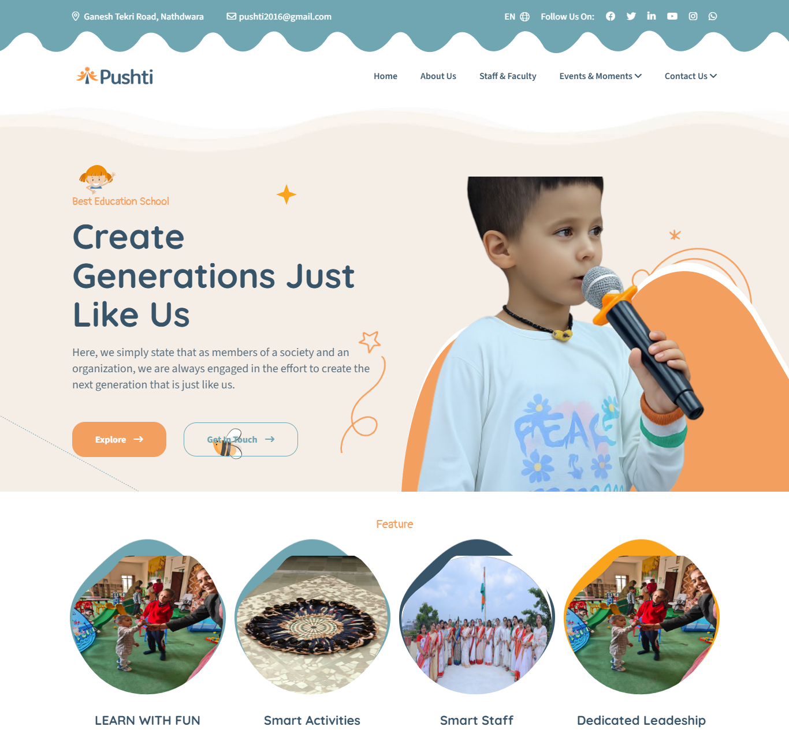
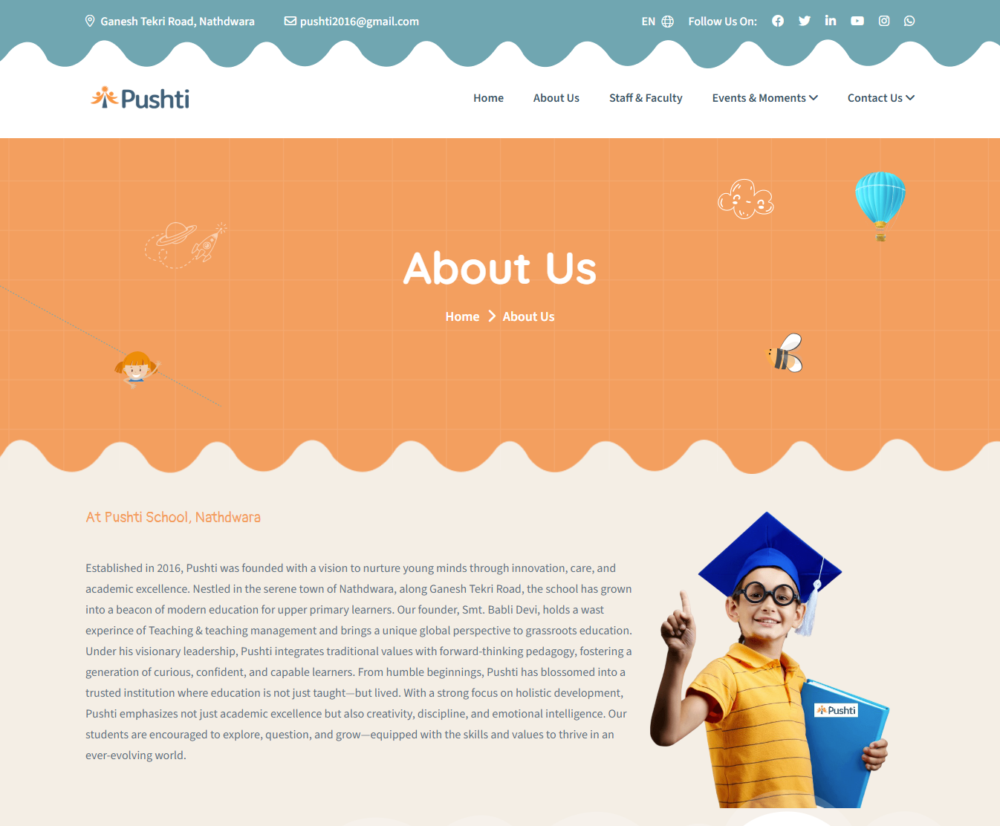
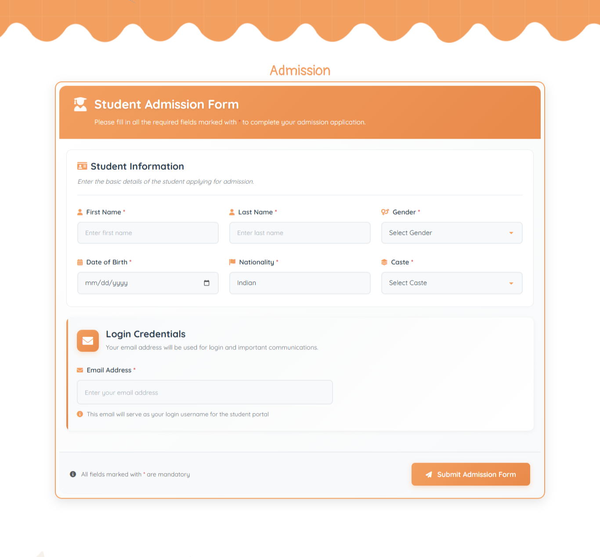
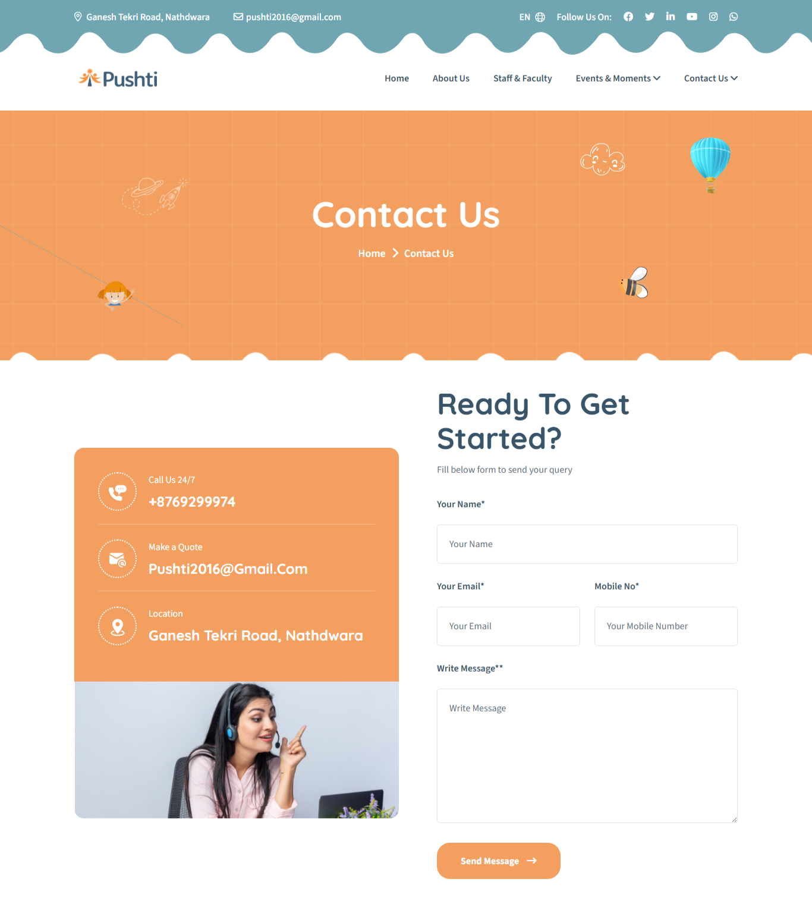
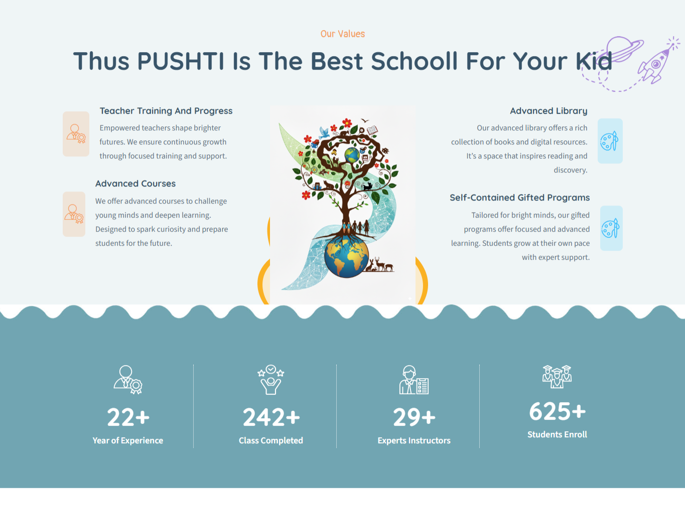

# 🎓 SCHOOL IFORMATION PLATFORM


A modern educational information and admissions platform designed to streamline institutional communication, digital admissions, content publishing, announcements, galleries, and multilingual engagement for students, parents, and visitors.

---

## 🌐 Live Platform

* Website: https://pushtischool.in/
* Admin Portal: https://pushtischool.in/admin

---

## Platform Vision

PUSHTI School is a modern digital education platform built to provide an engaging online experience for students, parents, visitors, and school administrators.

The platform combines institutional information, admission workflows, academic communication, media galleries, and multilingual content delivery into a unified educational ecosystem that enhances accessibility, engagement, and communication.

---

## ✨ Platform Highlights

* Digital Admission Management
* School Information Portal
* Multilingual Experience
* Dynamic Announcements
* Events & Activities Showcase
* Staff & Faculty Information
* Media Gallery Experience
* Parent Communication Features
* Mobile Optimized Design
* Responsive User Experience
* Rich Content Publishing
* SEO Friendly Architecture

---

# 🎓 Educational Experience Platform

The platform delivers a complete digital experience for educational institutions by providing seamless access to school information, admissions, events, communication channels, and academic content.

## Core Modules

### School Information Portal

* About Institution
* Vision & Mission
* Academic Information
* Leadership Information
* Staff & Faculty Profiles

### Digital Admissions

* Student Registration
* Online Admission Workflow
* Admission Application Forms
* Enrollment Management
* Digital Submission Process

### Communication Center

* Contact Forms
* Inquiry Management
* Parent Communication
* Visitor Engagement

### Events & Activities

* School Events
* Student Activities
* Academic Announcements
* Institution Updates

### Media Gallery

* School Galleries
* Event Showcases
* Campus Activities
* Educational Highlights

---

## Digital Admission System

The platform provides a streamlined online admission workflow that simplifies student enrollment and application management.

Features include:

* Student Information Collection
* Admission Registration Forms
* Digital Application Submission
* User-Friendly Enrollment Experience
* Responsive Admission Workflow

---

## Multilingual Experience

The platform supports multilingual content delivery through ngx-translate, enabling educational institutions to provide localized experiences for diverse audiences.

Features include:

* Language Switching
* Dynamic Translation Support
* Localized Content Delivery
* Improved Accessibility

---

## Business Problem

Educational institutions often face challenges with fragmented communication, manual admission processes, outdated content management workflows, and limited accessibility across devices.

These limitations can reduce engagement, slow administrative processes, and make information management difficult for schools and parents.

---

## Solution

PUSHTI School centralizes admissions, communication, announcements, content publishing, galleries, and institutional information into a single digital platform.

The solution improves accessibility, enhances parent engagement, streamlines communication workflows, and modernizes the school's digital presence.

---

## Platform Architecture

The platform follows a scalable component-driven architecture designed for educational institutions, multilingual content management, responsive user experiences, and seamless communication workflows.

```text
Students / Parents / Visitors
                │
                ▼
        Angular 19 Frontend
                │
                ▼
      Content Management Layer
                │
                ▼
           Backend APIs
                │
                ▼
        Database & Storage
```

---

## Enterprise Features

* Responsive Design Architecture
* Dynamic Content Publishing
* Rich Text Content Management
* SEO Optimized Structure
* Mobile Friendly Experience
* Component Driven Architecture
* Content Management Workflows
* User Engagement Features
* Scalable Frontend Architecture
* Modern Educational UI System

---

## Technology Stack

### Frontend Engineering

* Angular 19
* TypeScript
* SCSS
* Bootstrap

### Internationalization

* @ngx-translate/core
* @ngx-translate/http-loader

### Content Management

* TinyMCE
* Quill Editor
* ngx-editor

### User Experience

* ngx-toastr
* SweetAlert2
* Masonry Gallery

### Runtime Environment

* Node.js
* npm
* Angular CLI

---

# System Architecture

The platform follows a scalable component-driven architecture designed for educational institutions, multilingual content management, responsive user experiences, and seamless communication workflows.

<p align="center">
  
</p>

---

## Platform Preview

Modern educational workflows designed for students, parents, visitors, and administrators.

The platform delivers institutional information, digital admissions, communication systems, academic content, and responsive user experiences through a modern web architecture.

---

# 🌐 Platform Screenshots

### 🏠 Landing Experience



---

### 📚 About Institution



---

### 🎓 Digital Admission Management



---

### 📞 Communication Center



---

### ⭐ Values & Achievements



---

# 🔐 Platform Capabilities

* Digital Admission Management
* Content Publishing Workflows
* School Information Management
* Responsive User Interfaces
* Rich Text Editing
* Dynamic Content Delivery
* SEO Friendly Architecture
* Multilingual Experiences

---

# ⚡ Performance & Scalability

## Performance Highlights

* Angular Standalone Bootstrap
* Optimized Asset Loading
* Responsive Components
* Fast Navigation Experience
* Mobile Optimization
* Modern Frontend Architecture

---

## Platform Focus Areas

* Education Technology
* School Information Systems
* Digital Admissions
* Institutional Communication
* Educational Content Management
* Multilingual Web Applications
* Responsive Web Platforms

---

## Product Roadmap

### Phase 1 — Foundation

* School Information Portal
* Admission Management
* Events & Activities
* Media Gallery

### Phase 2 — Engagement

* Parent Dashboard
* Student Portal
* Notifications System
* Enhanced Communication

### Phase 3 — Digital Expansion

* Event Registration
* Analytics Dashboard
* Advanced Search
* Reporting Infrastructure

### Phase 4 — Future Innovation

* Mobile Application
* Smart Notifications
* AI-Assisted Support
* Enhanced User Experiences

---

## Deployment Infrastructure

* VPS Deployment
* Nginx Support
* Apache Support
* IIS Hosting
* Cloud Hosting
* CI/CD Ready Workflows

---

## Repository Structure

```text
assets/
├── architecture/
├── branding/
├── screenshots/
└── workflows/
```

---

# Engineering Vision

PUSHTI School represents a modern educational platform engineered to improve communication, admissions, content management, and digital engagement for educational institutions.

The platform focuses on accessibility, user experience, multilingual communication, and scalable frontend architecture.

---

# Why This Platform Exists

Educational institutions need modern digital experiences that simplify communication, streamline admissions, and improve accessibility for students and parents.

PUSHTI School was developed to provide a centralized platform that modernizes school communication, information delivery, and educational engagement through a responsive digital experience.

---

# 📄 License

MIT License

Copyright © 2026 SHIVAM ITCS
